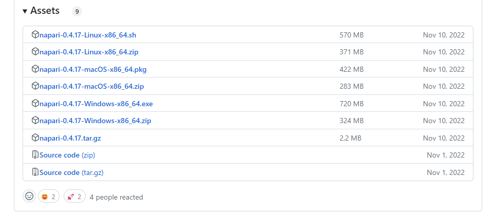
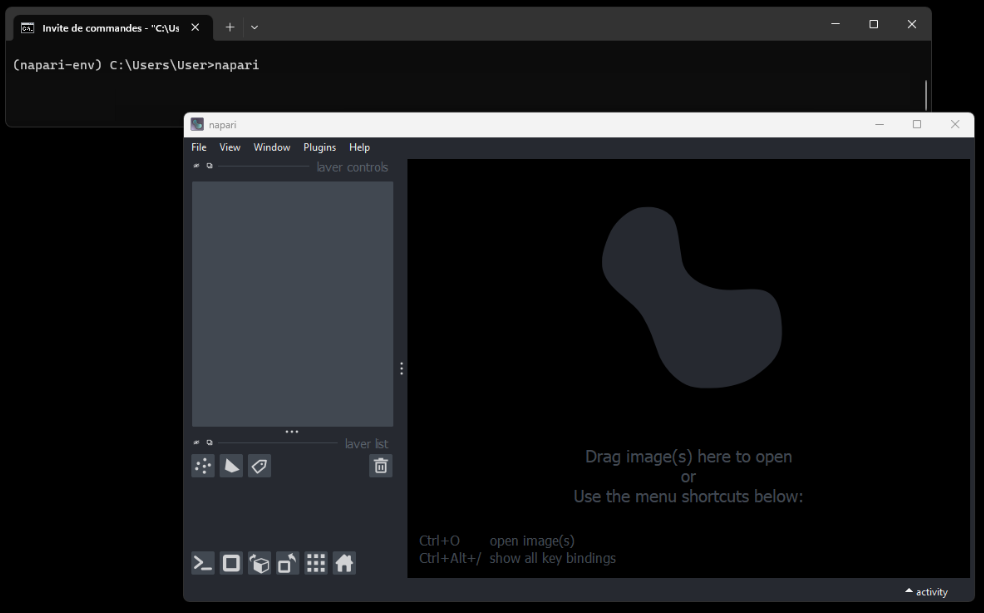

# Napari and getting started

Napari is available in two forms:
- **Bundled app**
- **Python package**

## Bundled app

Napari as a standalone GUI app can be installed only in Windows, macOS and Linux.
Please note that you do not need to have Python installed.
In [release page](https://github.com/napari/napari/releases), you can find all versions developped.



⚠️ Bundled app is still in active development, and may not be very stable.

I refer you to this [page](https://napari.org/stable/tutorials/fundamentals/installation.html#install-as-a-bundled-app) for more information

## Python package

You must be into a clean virtual environment using an environment manager like **conda** with python version 3.9.

```
conda create -y -n napari-env -c conda-forge python=3.9
conda activate napari-env
```

When you are into virtual environment with python version 3.9, you can install napari via `pip`, `conda-forge` or from source via `git`.

If you want install napari using pip in macOS, Linux, and Windows systems, you should have Python 3.7, 3.8, and 3.9 in your computer. So, you install napari with this following command:

```
python -m pip install "napari[all]"
```

Note: running `pip install "napari[all]"` will install the default framework PyQt5 used for user interface.

When installation is done, you are able to launch napari from the command line

```
napari
```



I refer you to this [page](https://napari.org/stable/tutorials/fundamentals/installation.html#install-as-python-package-recommended) for more information.