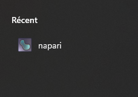
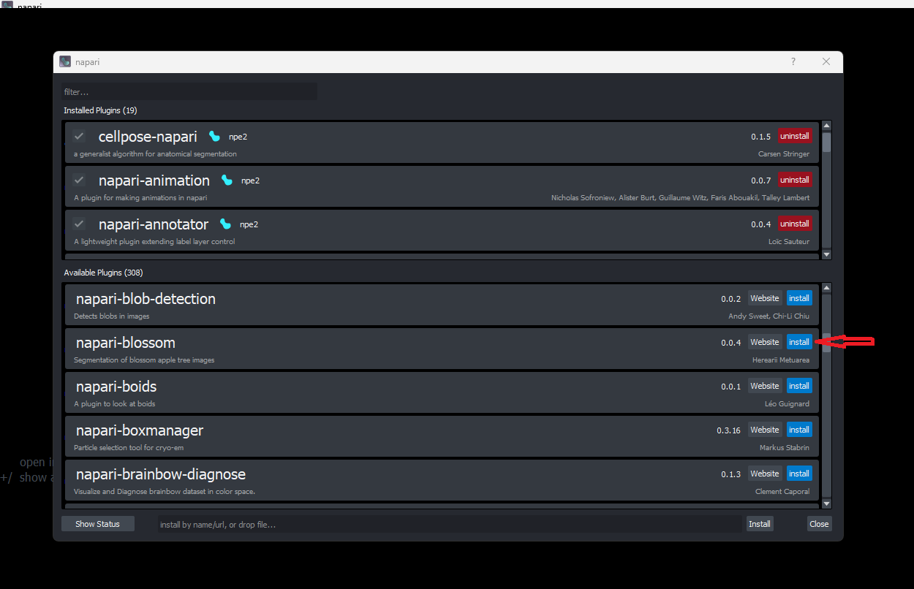

# Getting started a napari-plugin

## Open Napari and install plugin

1- Open napari as bundled app.

2- At the top left, enter the box *Plugins* and click *Install/Uinstall Plugins*

3- Search the menu for the napari-blossom plugin, then install by clicking *Install*.

4- Restart Napari

At the top left, enter the box *Plugins*, and see napari-blossom is installed: congratulations.

## Getting started

1- Import an image by dragging it into the window

2- Run leaf detection using the inference button

3- Export segmentation mask