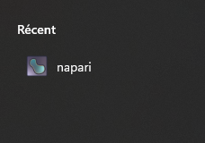
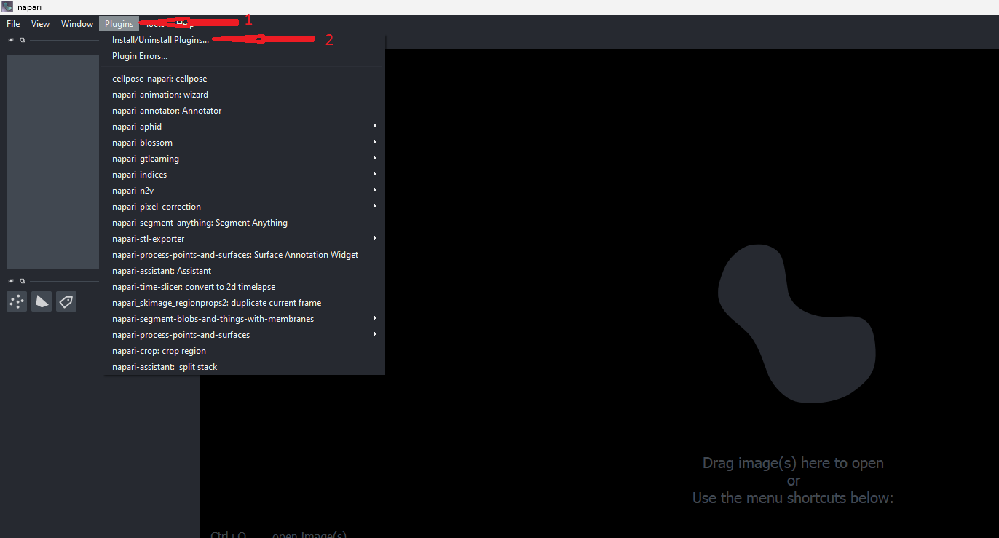

# Getting started a napari-plugin

## Open Napari and install devbio-napari plugin

1- Open napari as bundled app.

2- At the top left, enter the box *Plugins* and click *Install/Uinstall Plugins*

3- Search the menu for the devbio-napari plugin, then install by clicking *Install*.

4- Restart Napari

At the top left, enter the box *Plugins*, and see devbio-napari is installed: congratulations.

## Getting started : calculating the aphid surface area

1- Import an image by dragging it into the window

2- Invert image grayscale

Tools > Image math > Invert-image (n-Simple ITK)

3- Object segmentation using Gauss-Otsu

Tools > Utilities > Assistant (na) > Label > Operation: Gauss-Otsu labeling (nsbatw)

4- Present the measures

Tools > Measurement tables > Measurement (n-Simple ITK)
