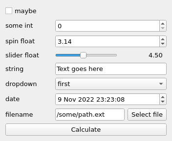

# Widget and Magicgui

## Script

The script is contained in the notebook `leaf_area.ipynb`. We want determine the leaf area of some leaf:


## Add a widget

Here, we integrate a python script into widget. We are using three files to integrate the widget:

- `_widget.py` contains the widget codes

- `__init__.py` contains all the functions needed to initialise modules and control imports

- `napari.yaml` contains all the metadata and configuration information

- `setup.cfg` contains all package metadata for setuptools

## GUI for widget

There are many libraries designed to build a graphical user interface (GUI). For example, Tkinter or PyQt5. On napari, PyQt5 is highly recommended for building a GUI. This advice is generally aimed at advanced programmers. Building a GUI requires a lot of time and code. As a result, it is very difficult for novice programmers to design a code from scratch.

### Magicgui

The napari community has created a **magicgui** library to shorten the process of creating a GUI. **magicgui** is a general abstraction layer on GUI toolkit backends (like Qt), with an emphasis on mapping python types to widgets. This library is aimed at programming novices. It makes building widgets to represent function inputs easy. Below is an illustration of how to use magicgui:

#### Quick List of magicgui parameters

- `layout` (`str`, `optional`) – The type of layout to use. Must be `horizontal` or `vertical` by default "vertical".

- `call_button` (`bool` or `str`, `optional`) – If `True`, create an additional button that calls the original function when clicked. If a `str`, set the button text. If None (the default), it defaults to `True` when `auto_call` is `False`, and `False` otherwise.

- `result_widget` (`bool`, `optional`) – Whether to display a LineEdit widget the output of the function when called, by default `False`

- **param_options** (dict[str, dict]) – Any additional keyword arguments will be used as parameter-specific options. Keywords must match the name of one of the arguments in the function signature, and the value must be a dict of keyword arguments to pass to the widget constructor.

And many more in [magicgui page](https://pyapp-kit.github.io/magicgui/api/magic_factory/)

## Example

```
from magicgui import magic_factory
import datetime
import pathlib

@magic_factory(
    call_button="Calculate", # call_button
    slider_float={"widget_type": "FloatSlider", 'max': 10}, # param_options
    dropdown={"choices": ['first', 'second', 'third']}, # param_options
)
def widget_demo(
    maybe: bool,
    some_int: int,
    spin_float=3.14159,
    slider_float=4.5,
    string="Text goes here",
    dropdown='first',
    date=datetime.datetime.now(),
    filename=pathlib.Path('/some/path.ext')
):
    ...

widget_demo.show()
```



## Input and Output of widget

Napari identifies each element according to an object class.

### Input

The elements that are given by a user are generally seen as elements belonging to the objects of the class `napari.types`. In this session, users will upload RGB images. The images in the class are presented under the variable `napari.types.ImageData`.

- `napari.types.ImageData` : RGB images

More broadly, users can provide input for other objects. Below are the object types and their variables.

- `napari.types.LabelsData` : Binary mask

- `napari.types.PointsData` : Points data

- `napari.types.ShapesData` : Shapes data

- `napari.types.VectorsData` : Vectors data

More information in [napari.types](https://napari.org/stable/api/napari.types.html)

### Output

The output of napari treatments is generally rendered in the form of a **layer**. These layers belong to the class `napari.layers`. In this sessions, users will create binary image. So the binary images made by napari are presented under the variable `napari.layers.LabelsData`.

- `napari.layers.Labels` : binary or multiclass mask

This object has several parameters which give some information about the layer. Some of them are listed below:

    - `data` : array or list of array
    - `colormap` : colormap name
    - `name` : Name of the layer

See [napari.layers.Image](https://napari.org/stable/api/napari.layers.Image.html#napari.layers.Image) for exhaustive list of parameters.

More broadly, users can provide input for other objects. Below are the object types and their variables.

- `napari.types.Image` : Binary mask

- `napari.types.Points` : Points data

- `napari.types.Shapes` : Shapes data

- `napari.types.Surface` : Vectors data
