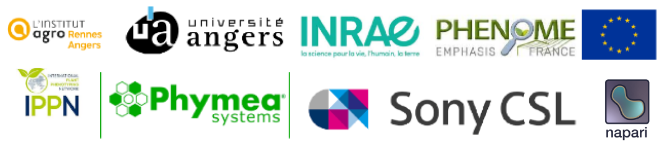

# IPPN:Napari as a tool for phenotyping



This is a training tutorial to learn how to integrate deep learning model into napari plugin from scratch

## Useful links

Video tutorial (in french) : 

- [Installer NAPARI et faire son premier plugin](https://www.youtube.com/watch?v=lMEVJxIlkXw&ab_channel=ImHorPhenBioimagingresearchgroup)

- [NAPARI Plugin for deep segmentation and manual correction](https://www.youtube.com/watch?v=Wzgl1aDT504&t=872s&ab_channel=ImHorPhenBioimagingresearchgroup)

## How this training works

You should first clone the repository into your computer:

```
git clone https://github.com/hereariim/IPPN_napari.git
```

## Authors

Herearii Metuarea, Research Engineer at INRAe

## Other contributors

Imhorphen team at INRAe:

* David Rousseau, Full Professor, University of Angers
* Pejman Rasti, Assistant professor, University of Angers
* Félix Mercier, Research Engineer, INRAe